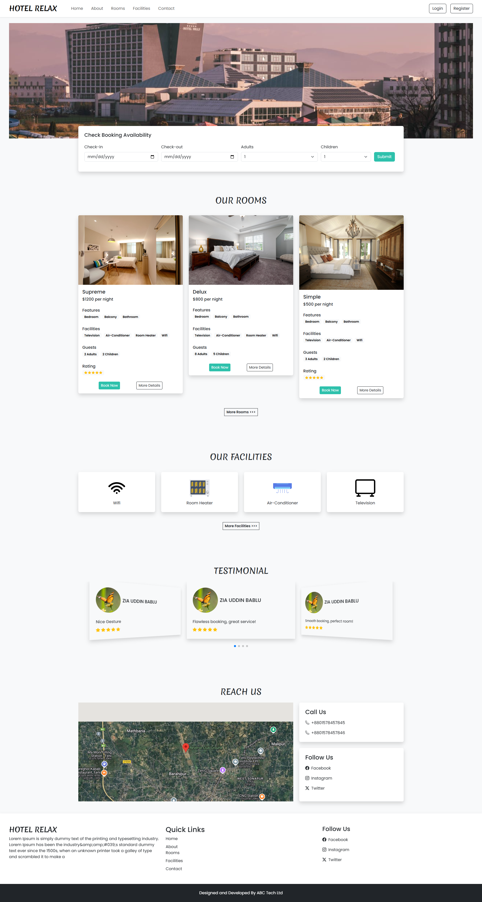
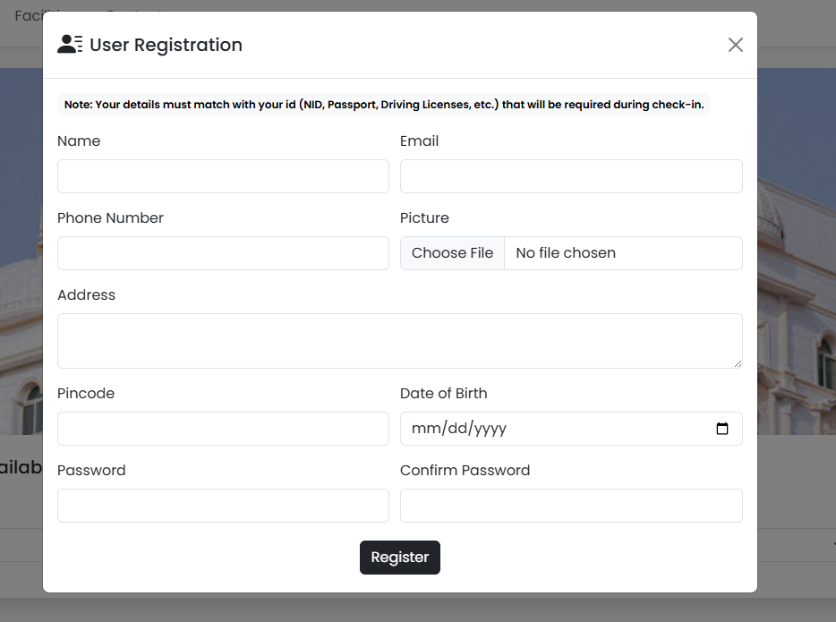
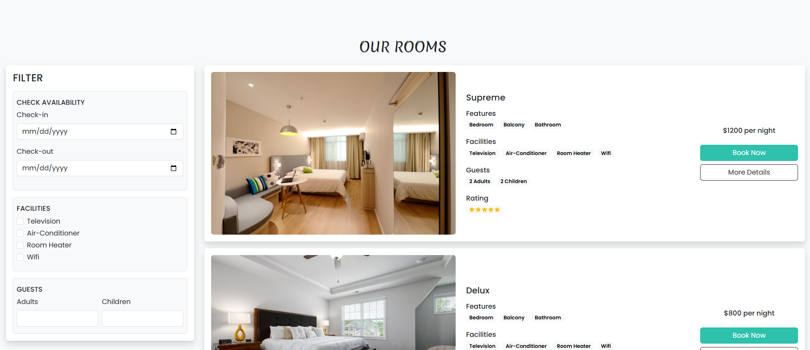
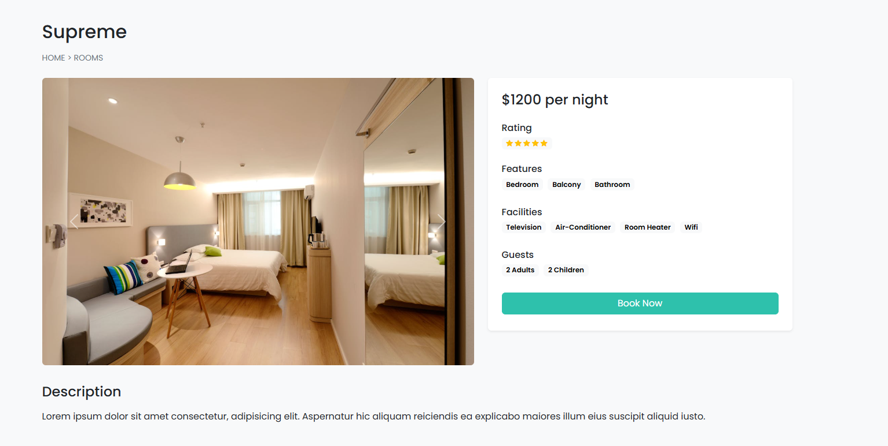
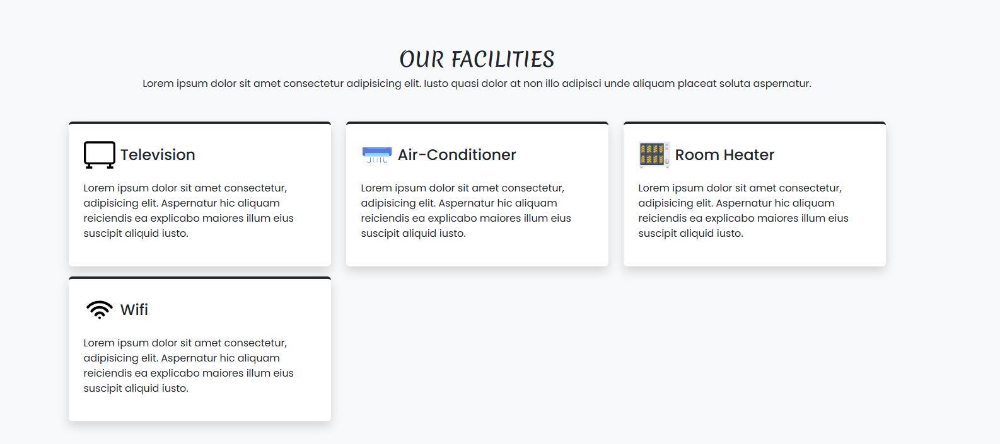
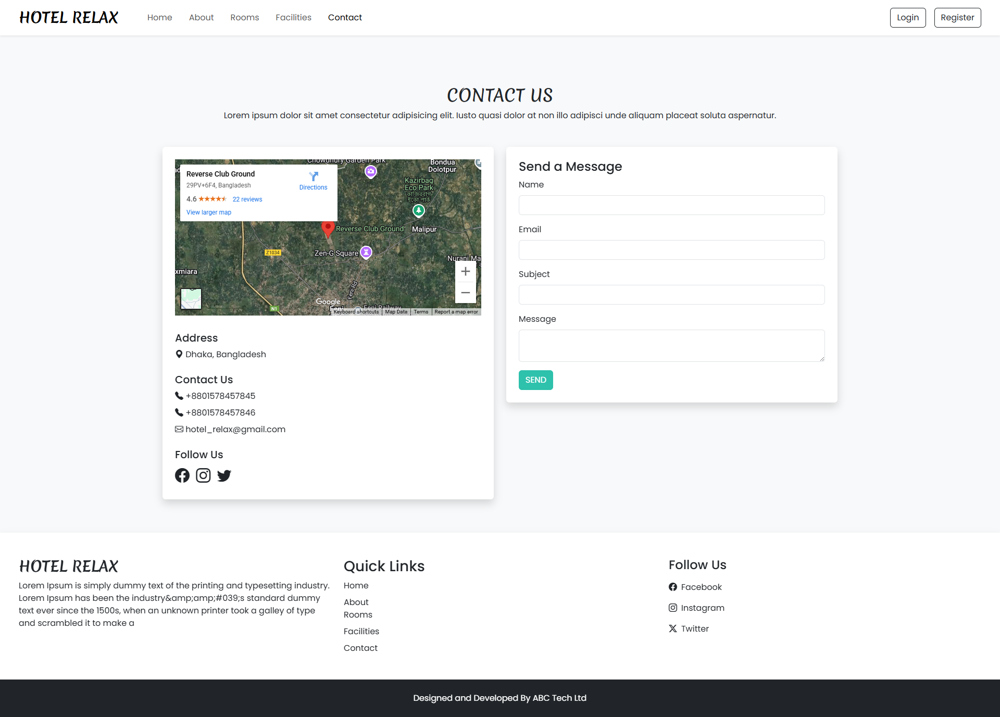
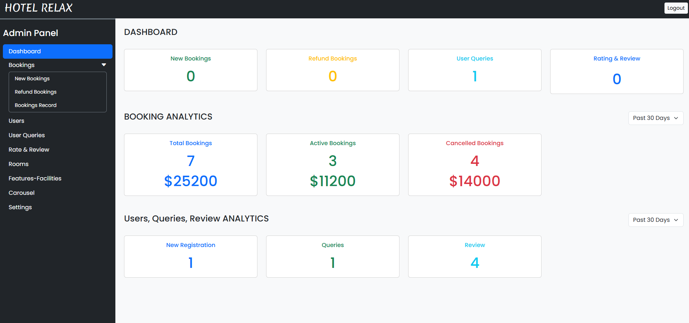

# 🏨 HOTEL RELAX – Hotel Booking Website  
Welcome to HOTEL RELAX, a modern and user-friendly hotel booking platform.
This project is designed to provide a seamless experience for users to explore, view details, and book hotel rooms securely. It also includes a powerful admin dashboard to manage bookings, rooms, and users efficiently.

# 📸 Screenshots

# ✨ Features
🏨 Browse all available rooms  
📄 View detailed room information  
👤 User authentication (Register & Login)  
💳 Secure Stripe payment integration  
📅 Book rooms with date selection  

# 📊 Admin dashboard for: 
Managing rooms   
Viewing bookings  
Handling users  
Viewing analytics and reports  

# 🛠️ Technologies Used
Frontend: HTML, CSS, JavaScript, Bootstrap 5  
Backend: PHP  
Database: MySQL  
Payment: Stripe API  
